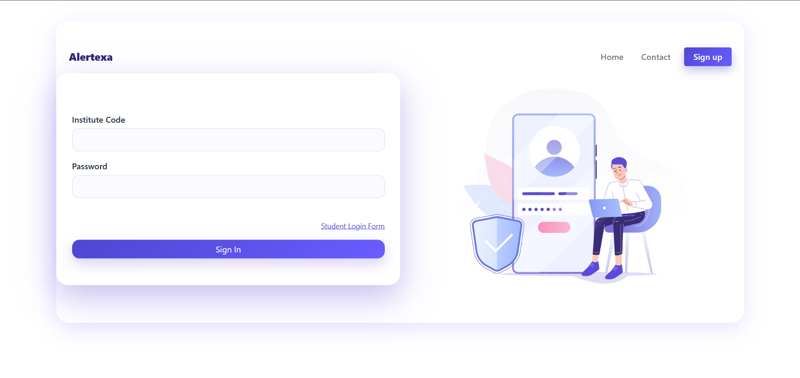
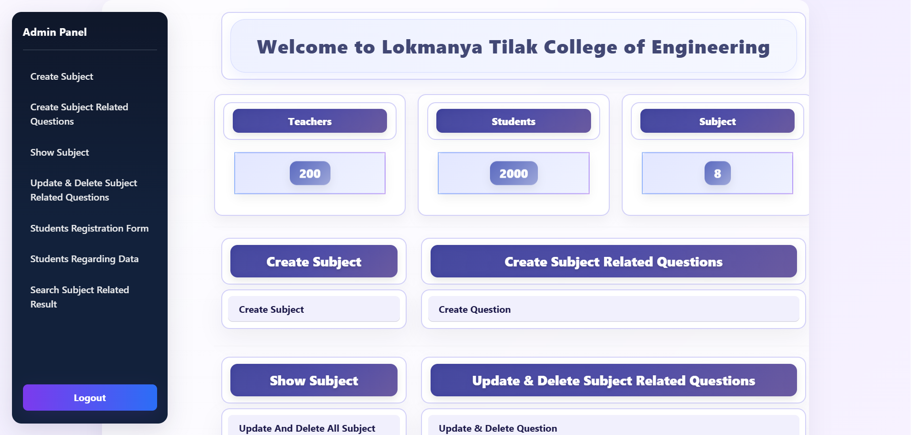
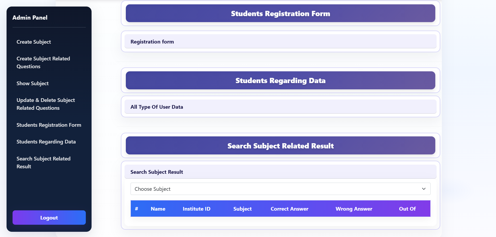
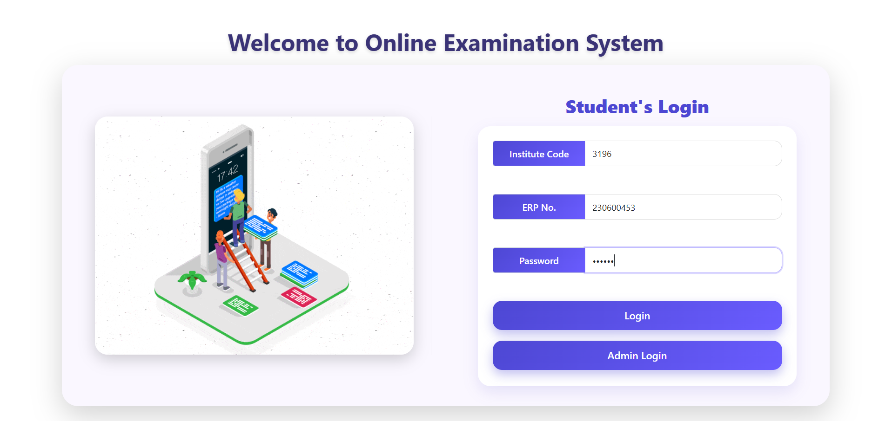
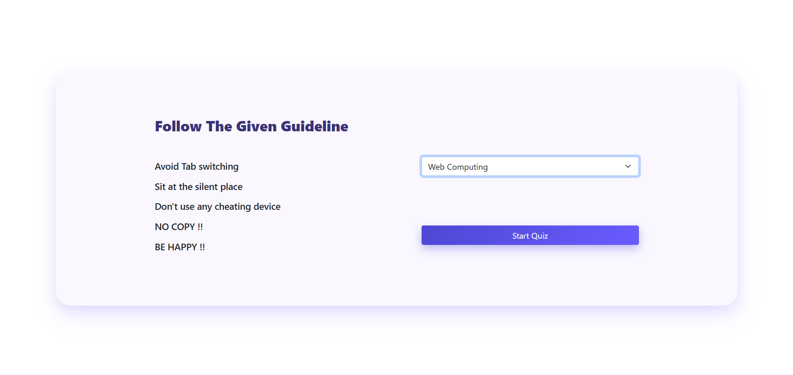
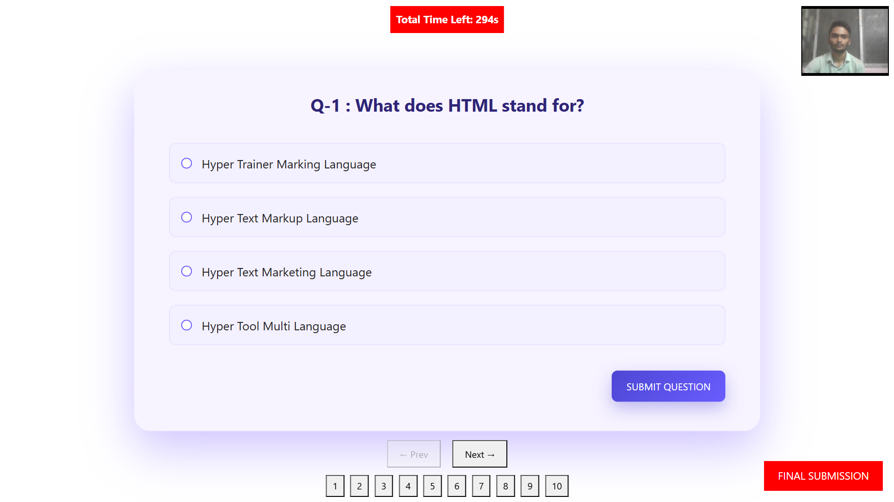
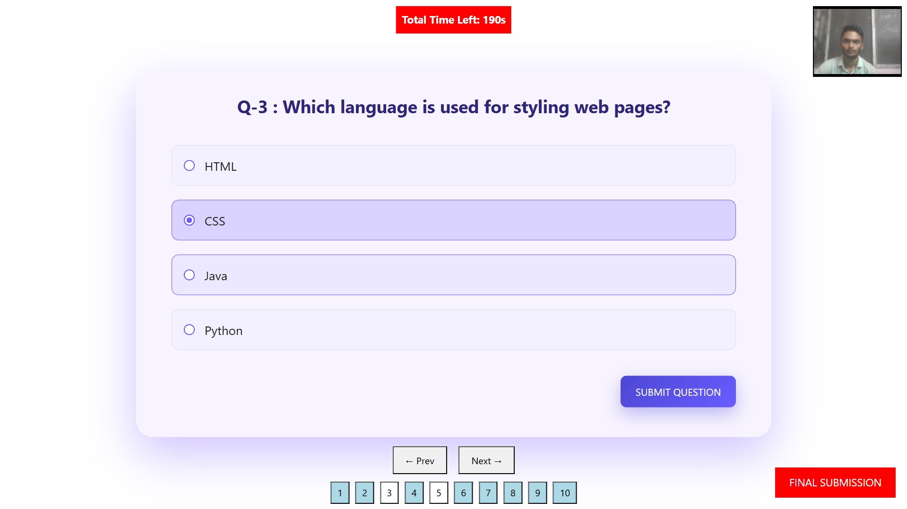
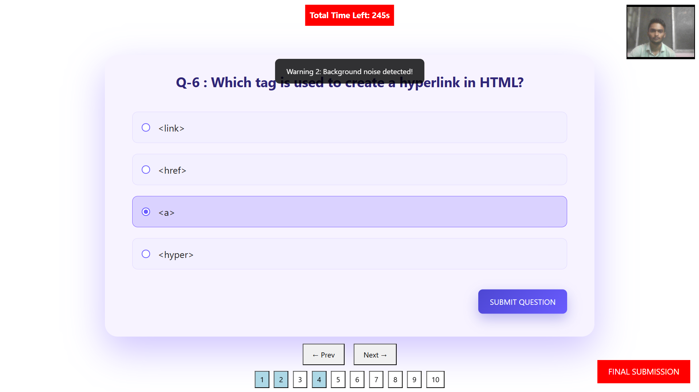
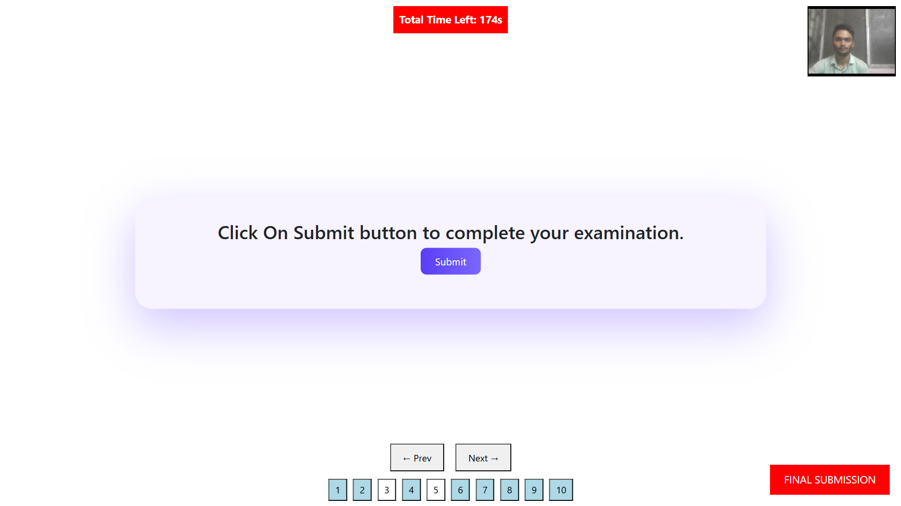

# 🛡️ AlertExa – Smart AI Proctoring & Quiz Management System

**AlertExa** is a high-performance, web-based examination platform designed to ensure the integrity of online tests. By leveraging real-time AI computer vision and browser-based monitoring, it provides a secure environment for institutes to conduct exams while preventing common cheating practices.

---

## 🚀 Features

- **🤖 AI-Powered Camera Proctoring**: Real-time face detection using `face-api.js` to identify multiple faces or when the examinee is missing.
- **🔇 Background Noise Detection**: Monitors microphone input; the test is **automatically submitted after 3 detections** of suspicious audio or background conversations.
- **🚨 Tab-Switch Tracking**: Automatically detects when a student switches tabs or minimizes the browser, and automatically submits the test in such cases.
- **🖥️ Fullscreen Enforcement**: Ensures the exam is taken in fullscreen mode to minimize distractions and external assistance.
- **📊 Comprehensive Dashboards**: 
  - **Institute Dashboard (Admin Panel)**: 
    - **Subject Management**: Create, view, update, and delete subjects.
    - **Question Bank**: Generate and manage subject-specific questions.
    - **Student Administration**: Access student registration forms and manage student-related data.
    - **Result Analytics**: Search and analyze subject-related results with overall statistics (Teachers, Students, Subjects).
  - **Student Portal**: 
    - **Secure Access**: Log in using ERP and Password credentials provided by the institute/teacher.
    - **Exam Interface**: Seamlessly take proctored tests assigned by the institute.
- **⏳ Smart Exam Management**: Automated timers, question navigation, and secure session management.

---

## 🛠️ Tech Stack

- **Frontend**: HTML5, CSS, JavaScript (ES6+), Bootstrap 5, Animate.css
- **AI/ML Libraries**: `face-api.js` (Face Detection & Landmarks), `Web Audio API` (Noise Detection)
- **Utilities**: `SweetAlert` (Interactive Dialogs)
- **Data Storage**: LocalStorage & SessionStorage (Client-side persistence)

---

## 📁 Project Structure

```text
ALERTEXA/
├── Alertexa/
│   ├── common/        # Shared assets (Bootstrap, SweetAlert, CSS/JS)
│   ├── company/       # Institute portal (Login, Registration)
│   ├── dashboard/     # Admin/Institute dashboard & student management
│   ├── homepage/      # Student login & landing page
│   ├── quiz/          # Core quiz engine & AI proctoring logic
│   ├── models/        # Pre-trained models for face-api.js
│   ├── welcome/       # Project landing screen
│   └── models/        # AI Models for face detection
└── README.md          # Project Documentation
```

---

## ⚙️ Installation & Setup

1. **Clone the repository**:
   ```bash
   git clone https://github.com/aaryannighut/AlertExa.git
   cd AlertExa
   ```

2. **Open the project**:
   - Open the folder in **VS Code**.
   - Ensure you have the [Live Server](https://marketplace.visualstudio.com/items?itemName=ritwickdey.LiveServer) extension installed.

3. **Run the application**:
   - Navigate to `Alertexa/company/company.html`.
   - Right-click on the file and select **"Open with Live Server"**.

---

## 🔑 Environment Variables

> [!NOTE]
> This is a frontend-heavy application using client-side storage. No `.env` files are required for the basic setup.

---

## ▶️ Usage

### For Institutes:
1. Register/Login at the **Institute Portal** (`company.html`).
2. Create subjects and add multiple-choice questions via the **Dashboard**.
3. Monitor results and student enrollments.

### For Students:
1. Login via the **Student Portal** (`homepage.html`) using the ERP and Password credentials provided by the institute/teacher.
2. Grant camera and microphone permissions.
3. Start the test and remain in fullscreen mode with the camera active.

---

## 🔄 Workflow / Architecture

1. **Authentication**: Users (Institutes/Students) authenticate using credentials stored and validated against `localStorage`.
2. **Proctoring Activation**: Upon starting a quiz, the system initializes `face-api.js` and the `Web Audio API`.
3. **Continuous Monitoring**: 
   - **AI Face Monitoring**: The `detectFaces()` Continuous monitoring for faces. 
   - **Background Noise Monitoring**: The `detectNoise()` loop flags suspicious audio.
   - **Tab Switching**: Active monitoring via `visibilitychange`.
4. **Violation & Auto-Submission Rules**: 
   - **Voice**: The test is **automatically submitted** after 3 noise detections. 
   - **Tab Switching**: The test is **submitted directly** if the student switches tabs or minimizes the window.
   - **Face Detection**: Continuous monitoring ensures the presence of the candidate throughout the exam.
5. **Result Aggregation**: Scores are calculated on the fly and stored in `brandCode_subject_result`.

---

## 📸 Screenshots

### 📷 Login Page
<p align="center">
  
</p>

### 📊 Institute Dashboard
<p align="center">
  
  
</p>

### 👤 Student Dashboard
<p align="center">
  
  
</p>

### ✍️ Student Quiz & Proctoring
<p align="center">
  
  
</p>

### 🚨 Warning Message
<p align="center">
  
</p>

### ✅ Submit the Test
<p align="center">
  
</p>

---

## 🎯 Use Cases

- **Online Academic Exams**: Schools and Universities conducting remote assessments.
- **Hiring/Recruitment**: HR teams conducting initial technical screenings.
- **Certification Programs**: Ensuring credentialing integrity for online courses.

---

## 🚧 Future Improvements

- [ ] **Backend Integration**: Implement Node.js/Express and MongoDB for centralized data management.
- [ ] **Object Detection**: Detect mobile phones or books in the camera frame.
- [ ] **Email Alerts**: Automatically notify examiners about proctoring violations.
- [ ] **AI-Based Eye Tracking**: Enhanced monitoring for gaze detection.

---

## 🤝 Contributing

Contributions are what make the open-source community such an amazing place to learn, inspire, and create. Any contributions you make are **greatly appreciated**.

1. Fork the Project
2. Create your Feature Branch (`git checkout -b feature/AmazingFeature`)
3. Commit your Changes (`git commit -m 'Add some AmazingFeature'`)
4. Push to the Branch (`git push origin feature/AmazingFeature`)
5. Open a Pull Request

---

## 👨‍💻 Author

- **AlertExa Development Team**
  - Aaryan Nighut
  - Aarya Nighut
  - Ekanksh Mohite
  - Rahul Yadav

- **GitHub**: [aaryannighut](https://github.com/aaryannighut)

---

<p align="center">Made with ❤️ for a better online examination experience.</p>
